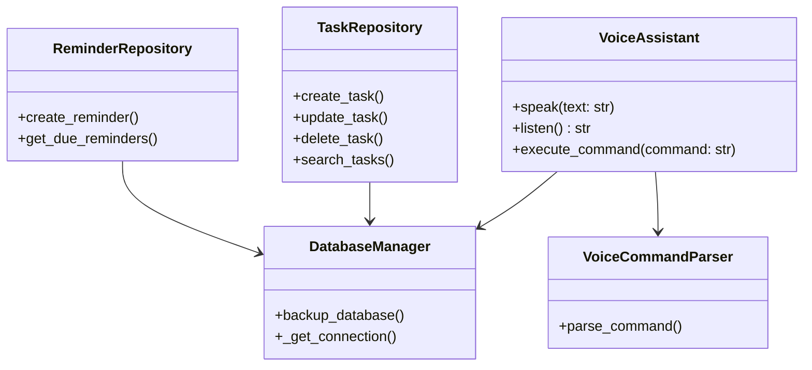

# Voice Task Manager Bot


[](https://opensource.org/licenses/MIT)

A sophisticated voice-controlled task management system with SQLite database backend, reminder functionality, and natural language processing.

## Key Features

- **Voice Interaction**: Fully voice-controlled interface with speech recognition
- **Task Management**: Create, update, and delete tasks with due dates and priorities
- **Reminder System**: Set reminders for specific tasks with time-based notifications
- **Database Backend**: SQLite storage with automatic backups and data integrity
- **Natural Language Processing**: Understands complex voice commands
- **Background Processing**: Reminder checker runs in background thread
- **Error Handling**: Comprehensive error handling and logging

## Installation

### Prerequisites

- Python 3.10 or higher
- pip package manager

### Required Packages

Install dependencies with:

```bash
pip install SpeechRecognition pyttsx3
```

### Additional System Dependencies

- **macOS**: `brew install portaudio`
- **Linux**: `sudo apt-get install python3-pyaudio`
- **Windows**: PyAudio should install automatically via pip

## Usage

### Starting the Application

Run the voice task manager:

```
python voice_task_manager.py
```

### Voice Commands

The system understands these command patterns:

#### Task Management
- **Add Task**: "Add task [title] due by [YYYY-MM-DD] priority [low/medium/high]"  
  Example: "Add task finish report due by 2023-12-15 priority high"

- **Update Task**: "Update task [task-id] to [pending/completed]"  
  Example: "Update task 3a8b5c to completed"

- **Delete Task**: "Delete task [task-id]"  
  Example: "Delete task 3a8b5c"

- **Search Tasks**: "Search tasks for [keyword]"  
  Example: "Search tasks for meeting"

- **View Tasks**: "View all tasks"

#### Reminders
- **Set Reminder**: "Set reminder for task [task-id] at [HH:MM]"  
  Example: "Set reminder for task 3a8b5c at 14:30"

## Database Management

The application automatically:
- Creates a SQLite database (`voice_tasks.db`)
- Performs regular backups (keeps last 5)
- Maintains data integrity with transactions

### Backup Files
- Automatic backups are created with timestamp suffixes
- Old backups are automatically cleaned up

## Configuration

Configuration is stored in `voice_assistant_config.json` with these defaults:

```json
{
  "speech_rate": 150,
  "voice_gender": "female",
  "time_format": "24h"
}
```

## Logging

Detailed logs are written to `voice_task_manager.log` with timestamps and log levels.

## Error Handling

The system includes comprehensive error handling for:
- Speech recognition failures
- Database operations
- Invalid commands
- System signals (Ctrl+C)

## Architecture



## Troubleshooting

### Common Issues

1. **Microphone Not Working**:
   - Check system microphone settings
   - Ensure no other application is using the microphone

2. **Speech Recognition Errors**:
   - Speak clearly in a quiet environment
   - Check internet connection (Google Speech Recognition requires internet)

3. **Database Issues**:
   - Verify write permissions in the current directory
   - Check disk space availability

## License

This project is licensed under the MIT License. See the [LICENSE](LICENSE) file for details.

## Disclaimer

This is a personal project intended for educational purposes. The developer makes no guarantees about the reliability or security of this software. Use at your own risk.
